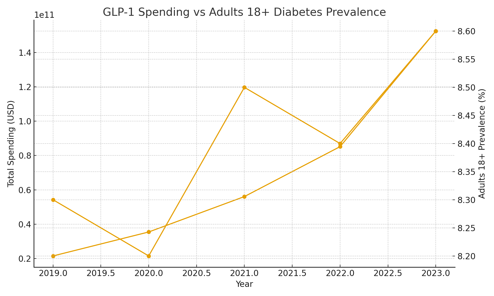

# The Ozempic Effect: A Data-Driven Analysis of Healthcare's New Frontier

## Overview
This project investigates the disruption caused by GLP-1 agonists (Ozempic, Wegovy, Rybelsus, Trulicity, Mounjaro, and Zepbound) across healthcare, economics, and consumer behavior. It quantifies the impact of these drugs on pharmaceutical revenues, Medicare Part D spending, diabetes prevalence, and the future outlook of obesity care.

This repository contains the full analytical workflow, cleaned datasets, code, and visualizations necessary to reproduce the analysis.

---

## Project Objectives
1. Quantify how much of Novo Nordisk and Eli Lilly’s revenue depends on GLP-1 drugs.
2. Measure Medicare Part D’s cost burden for GLP-1s.
3. Track diabetes prevalence among U.S. adults and seniors.
4. Forecast future spending, revenue, and market expansion through 2030.
5. Evaluate potential healthcare cost offsets from GLP-1 adoption.

---

## Datasets Used

### Company Financials
- **Novo Nordisk Annual Reports (2017–2024)** – PDF  
- **Eli Lilly Annual Reports (2020–2024)** – PDF  
  - Extracted from “Sales by product,” “Revenue by product,” or “Performance highlights.”
  - Output: `company_revenue.csv`
  - Columns: `Year | Company | Product | Revenue_DKK_million | Total_Company_Revenue | Percent_of_Total`
    
### Raw Source Files (External)

-Due to file size constraints, source PDFs for company annual reports are hosted externally.


**-Novo Nordisk Annual Reports (2017–2024)** and **Eli Lilly Annual Reports (2020–2024)**
-[Access on Google Drive](https://drive.google.com/drive/folders/1GGhzbpAqZbElwnlnxwzUF2GqQPQLjxfO?usp=drive_link
)

Each report includes product-level sales data used to extract GLP-1 revenues in `data/processed/company_revenue.csv`.

---

### Healthcare Spending (CMS)
- **Medicare Part D Drug Spending Dashboard (2016–2023)** – CSV  
- **CMS Formulary Reference File (FRF)** – XLSX  
  - Used for drug mapping and name normalization.
  - Output: `cms_spending.csv`, `cms_frf.csv`

### Population Health (CDC)
- **CDC Diabetes Prevalence (Adults 18+)** – `CDC_Younger.csv`  
- **CDC Diabetes Prevalence (Seniors 67+)** – `CDC_Older.csv`  
  - Combined into a unified dataset for national trends.
  - Output: `diabetes_trends.csv`

### Market and Industry Outlook
- **Patent Expiry Data** – `patent_expiry.csv`  
- **Market Forecasts (IQVIA/Allianz estimates)** – `market_forecasts.csv`

### Regulatory Data
- **FDA Approvals Timeline** – `fda_approvals.csv`  
- **FDA Drug Shortages** – `fda_shortages.csv`

### Economic and Consumer Insights
- **RAND/OECD/Finkelstein Cost Studies** – `obesity_costs_refs.csv`  
- **KFF/Ipsos Consumer Surveys** – `consumer_surveys.csv`

---

## Tools and Technologies

**Data Processing and Analysis**
- Python (Pandas, NumPy)
- SQL (for CMS data)
- Prophet or Statsmodels (for forecasting)

**Visualization**
- Plotly and Matplotlib (core analysis)
- Geopandas and Plotly (geographic insights)
- R Shiny (optional dashboard interactivity)

**Documentation and Collaboration**
- GitHub for version control and publication
- PDFPlumber or Tabula for PDF table extraction

---

## Workflow

### Step 1: Data Preparation
- Extract product-level revenues from annual reports.
- Clean and normalize Medicare Part D spending data.
- Match drug names using the Formulary Reference File.
- Merge CDC diabetes prevalence datasets.
- Export all cleaned datasets to `data/processed/`.

### Step 2: Core Analysis
- Calculate GLP-1 share of company revenue.
- Trend Medicare spending per beneficiary and per dosage unit.
- Overlay CDC diabetes trends with Medicare spending growth.

### Step 3: Extended Analysis
- Geographic insights: visualize GLP-1 spending vs diabetes prevalence by state.
- Predictive modeling: project spending and revenue to 2030.
- Health outcomes modeling: estimate potential obesity cost offsets.

### Step 4: Visualization
- Revenue share and product trends (Novo vs Lilly).
- Medicare spending and top GLP-1 drugs.
- Diabetes prevalence (18+ vs 67+).
- Patent expiry and market forecast timelines.
- Cost offsets: healthcare savings waterfall chart.

### Step 5: Deliverables
- Clean datasets (`data/processed/`)
- Interactive visualizations (`reports/figures/`)
- Forecast and regression notebooks (`notebooks/`)
- Final policy and industry report (`reports/ozempic_effect.pdf`)
- Optional dashboard app (`dashboard/`)

---

## Outputs
1. `company_revenue.csv` – Product-level revenues for Novo & Lilly.
2. `cms_spending.csv` – Medicare Part D spending per drug.
3. `cms_frf.csv` – Formulary reference mappings.
4. `diabetes_trends.csv` – National diabetes prevalence.
5. `market_forecasts.csv`, `patent_expiry.csv` – Long-term projections.
6. Visualizations and forecasts in `/reports/figures/`.
7. Interactive dashboard.
8. Final written report summarizing insights.

---

## Key Questions Answered
1. What percentage of Novo Nordisk and Eli Lilly’s revenue comes from GLP-1 drugs?
2. How has Medicare’s GLP-1 spending evolved from 2016 to 2023?
3. What is the relationship between diabetes prevalence and GLP-1 spending?
4. When will key patents expire, and how will that shift the market?
5. What are the future cost implications and savings potential for healthcare systems?

---

## Visual Insights

This section presents the most impactful visualizations from *The Ozempic Effect* project, highlighting the financial, healthcare, and population-level transformation driven by GLP-1 agonists.  
All figures were generated using Python (Plotly, Matplotlib, and Geopandas) based on processed datasets from CMS, CDC, and company financial reports.

---

### 1. Company Dependency on GLP-1 Products
Novo Nordisk and Eli Lilly have both experienced a rapid transition toward GLP-1-driven revenues.  
This visualization shows the percentage of each company’s total sales derived from GLP-1 drugs between 2017 and 2024, illustrating their growing reliance on metabolic health portfolios.


---

### 2. Medicare Part D Spending Growth (2016–2023)
Aggregate Medicare Part D expenditures on GLP-1 drugs have surged, particularly since 2021.  
The visualization highlights total federal outlays, rapid cost escalation, and the expanding role of GLP-1s in the national healthcare budget.


---

### 3. Beneficiaries and Average Spend per Beneficiary
The following plots demonstrate how both utilization and spending per Medicare beneficiary have risen sharply.  
They reveal the compounding effect of expanding patient access and higher therapy costs.

| Metric | Visualization |
|:-------|:--------------|
| Total Beneficiaries |  |
| Spend per Beneficiary |  |

---

### 4. Geographic and Demographic Dynamics
This overlay links GLP-1 Medicare spending to national diabetes prevalence among adults (18+) and seniors (67+).  
It functions as a geographic-style indicator of disease burden, adoption rate, and therapy penetration across population groups.



**Interactive Version (Optional):**  
[View Interactive Geographic Map](https://waithiran22.github.io/The-Ozempic-Effect-A-Data-Driven-Analysis-of-Healthcare-s-New-Frontier/geographic_spending_map.html)

---

### 5. Forecast and Future Cost Offsets (to 2030)
Forecast models project Medicare GLP-1 spending and beneficiary growth through 2030, then simulate potential healthcare cost offsets from reduced obesity- and diabetes-related complications.  
The results highlight the financial tradeoff between near-term expenditure and long-term system savings.

| Forecast | Visualization |
|:----------|:---------------|
| Spending Forecast |  |
| Net Cost Offsets (2030 Estimate) |  |

---

### 6. GLP-1 Revenue Share — Novo Nordisk vs Eli Lilly
This figure illustrates the growing dominance of GLP-1 products in both companies’ total revenues from 2017 to 2024, marking the shift from legacy diabetes care to obesity and metabolic health.


---

### 7. Diabetes Prevalence vs GLP-1 Spending
This visualization compares national diabetes prevalence (ages 18+ and 67+) with Medicare GLP-1 spending, revealing how therapeutic demand aligns with disease incidence.


---

### 8. Patent Expiry and Market Forecast Timeline
This timeline integrates GLP-1 patent expiry schedules (semaglutide: 2026–2032; tirzepatide: 2036) with projected global market growth, highlighting how exclusivity shapes future competition and innovation cycles.


---

📊 *All high-resolution figures are available in* [`/reports/figures/`](reports/figures/) *for further analysis and download.*

---

## Reproducibility
All analyses are reproducible using the included Python notebooks and datasets.  
Ensure dependencies are installed via:

```bash
pip install -r requirements.txt
```

## License
This project is licensed under the MIT License.
